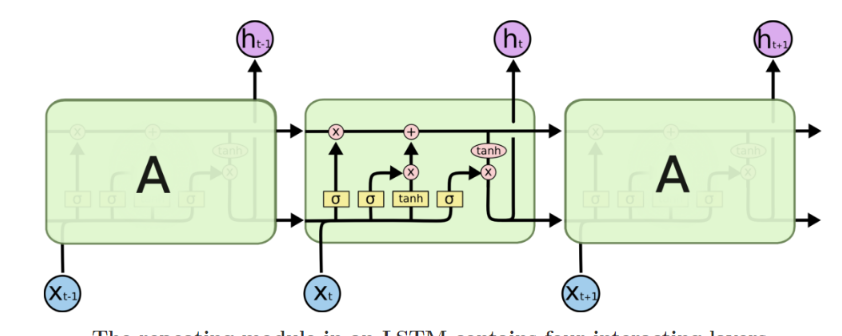

主要是把lstm的每个cell的输出  

)

)

+b_c)

)

)

 的解释是我们遗忘后的值加上添加后的值 

是  函数, 值在[0-1]之间. 所以

就代表遗忘后剩余的值,  描述了哪些值我们需要更新的.tanh值在[-1,1]之间代表创造出一个新的候选向量，可能会添加

到这个状态。 sigmoid layer值在[0-1]之间描述了每一个组件值有多少可以通过.

这篇文章中在输出层上做了些改动
 = tanh(W_{hc}h_t+b_{hc}))
假设  是 20\*200 的矩阵, 是 1\*20 的矩阵, 
 是 1\*1 )是一个1\*200的矩阵

然后 )

}{\\sum_{k=1}^{T}exp(e_k)}),

 是一个1\*200的矩阵 , 是一个20\*200的矩阵

所以c是一个20\*200的矩阵, 再加一个MLP层, ), 假设是 200\*200 然后一个softmax层, 

200*class_num, 损失函数为tf.reduce_mean(tf.nn.softmax_cross_entropy_with_logits(pred,y))

论文地址 http://pan.baidu.com/s/1o7L0HHS 1.pdf

